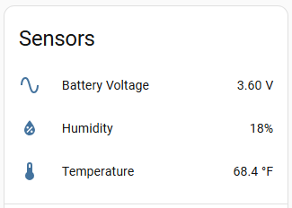
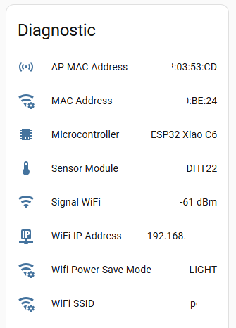
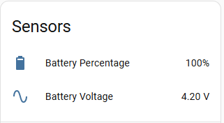
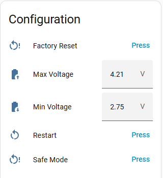
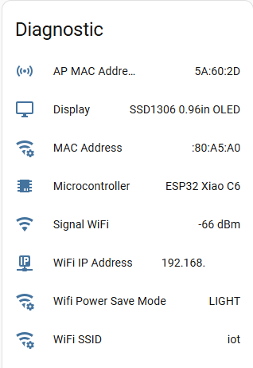

# esphome
My collection of ESPHome configurations

## Devices

<table>
    <thead>
        <tr>
            <td>Name</td>
            <td>Description</td>
            <td>YAML File</td>
            <td>Controls</td>
            <td>Sensors</td>
            <td>Configuration</td>
            <td>Diagnostic</td>
        </tr>
    </thead>
    <tbody>
        <tr>
            <td>diy-xiao-c6-dht22-sensor</td>
            <td></td>
            <td></td>
            <td></td>
            <td>
                <a href="./config/diy-xiao-c6-dht22-sensor.yaml">diy-xiao-c6-dht22-sensor</a>
            </td>
            <td>
                
            </td>
            <td>
                
            </td>
        </tr>
        <tr>
            <td>xiao-c6-lipo-charger-with-oled</td>
            <td>DIY LiPo charger status display using XIAO C6 + SSD1306 OLED</td>
            <td>
                <a href="./config/xiao-c6-lipo-charger-with-oled.yaml">xiao-c6-lipo-charger-with-oled</a>
            </td>
            <td>
                
            </td>
            <td>
                
            </td>
            <td>
                
            </td>
            <td>
                
            </td>
        </tr>
    </tbody>

</table>


## WSL Stuff
This is only relevant if you are attempting to run esphome on Windows via WSL

Need to pass through the USB device.
Install usbipd - https://github.com/dorssel/usbipd-win

```powershell
usbipd list
```

```powershell
# Replace the busId with the COM Port from above
usbipd bind --busid 2-5
```

```powershell
# Replace the busId with the COM Port from above
usbipd attach --wsl --busid  2-5
```

Deep Sleep Emergency Recover
```
while ! esphome upload soil-w001.yaml --device /dev/ttyACM0; do sleep 1; done
```

## References
* https://esphome.io/components/packages/
* https://esphome.io/guides/creators/