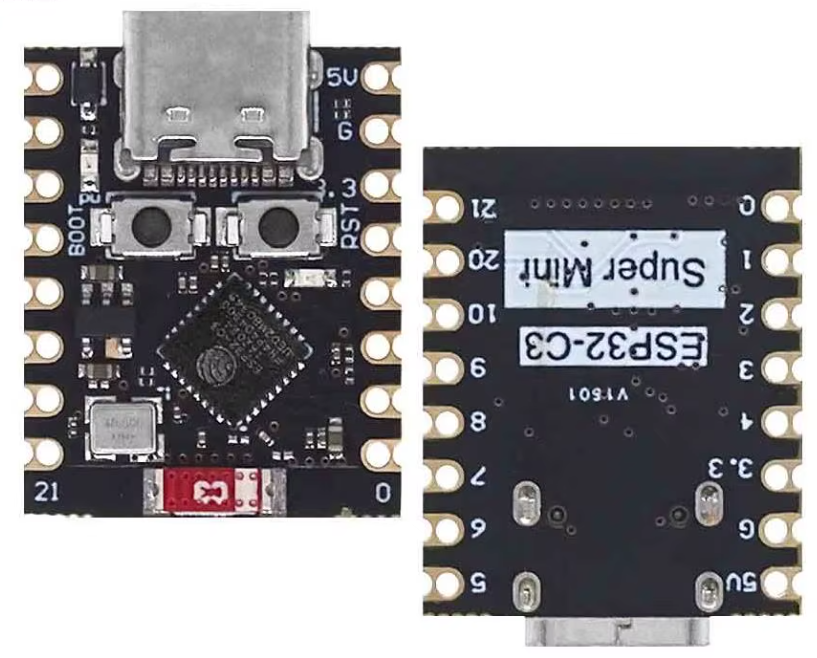

# AliExpress ESP32-C3 Mini

Picked up on [AliExpress](https://www.aliexpress.us/item/3256808827955225.html?spm=a2g0o.order_list.order_list_main.10.5b341802JXjZCl&gatewayAdapt=glo2usa)

* USB-C
* Brand Name: EYEWINK
* Datasheet: N/A
* Dimensions: 22.52x18mm

## ESPConnect Report
* ESPConnect Version: 1.1.

### Flash & Clock
* Crystal 40 MHz
* Flash Device : 4 MB
* USB Bridge : Espressif Systems - ESP32 Native USB (0x1001)

### Feature Set
* Wi-Fi
* BLE
* Embedded Flash 4MB (XMC)

### Package & Revision
* Chip Variant: ESP32-C3 (QFN32)
* Package Form Factor: 32-pin QFN (5 mm x 5 mm)
* Revision: v0.4

### Security
* Flash Encryption: disabled
* Flash Encryption Details: FLASH_CRYPT_CNT=0x0 (set bits=0)
* Flash Encryption Mode: XTS AES (supported on this chip)
* Secure Boot: disabled
* Secure Boot Type: v2 (digest-based, supports revocation)
* JTAG Protection: enabled
* USB Protection: not applicable for this chip

### Embedded Memory
* Embedded Flash: 4MB (XMC)
* Flash ID: 0x164046
* Flash Manufacturer: 0x46
* Flash Device: 4 MB

### Peripherals
* PWM/LEDC: 6 channels · 4 timers · Single LEDC group.

## Pin Information
No official pin information found so far. What we do know...

> Rich interface: 1xI2C, 1xSPI, 2xUART, 11xGPIO(PWM), 4xADC
> Onboard LED blue light: GPIO8 pin

16 Header Pins. The following is best guess AI generated. These
are NOT confirmed yet:

| Board Label | GPIO | Notes |
|-------------|------|-------|
| 5V | — | 5V power from USB |
| G | GND | Ground |
| 3.3 | 3.3V | 3.3V regulated output |
| 4 | GPIO4 | ADC1_CH4 |
| 3 | GPIO3 | ADC1_CH3 |
| 2 | GPIO2 | ADC1_CH2, strapping pin |
| 1 | GPIO1 | ADC1_CH1 |
| 0 | GPIO0 | ADC1_CH0 |
| 21 | GPIO21 | UART0 TX |
| 20 | GPIO20 | UART0 RX |
| 10 | GPIO10 | Free GPIO |
| 9 | GPIO9 | Strapping pin, BOOT button |
| 8 | GPIO8 | Strapping pin, onboard LED |
| 7 | GPIO7 | Free GPIO |
| 6 | GPIO6 | Recommended I2C SCL |
| 5 | GPIO5 | ADC2_CH0, recommended I2C SDA |

## Images
