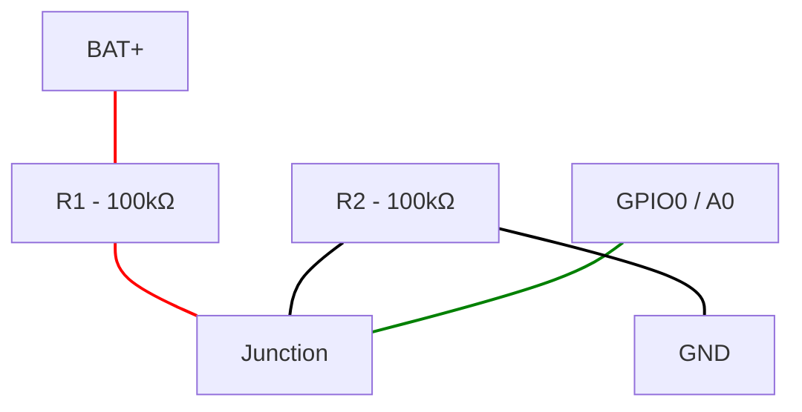

# Seeed Studio XIAO ESP32-C6

Picked up on [Seeed Studio](https://www.seeedstudio.com/Seeed-StudioXIAO-ESP32C6-3PCS-p-5918.html)

* USB-C
* Brand Name: Seeed Studio
* Datasheet: [ESP32-C6 Datasheet](https://www.espressif.com/en/products/socs/esp32-c6)
* Dimensions: 21x17.8mm

## ESPConnect Report
* ESPConnect Version: 1.1.10

### Flash & Clock
* Crystal 40 MHz
* Flash Device : 4 MB
* USB Bridge : Espressif Systems - ESP32 Native USB (0x1001)

### Feature Set
* Wi-Fi 6
* BT 5
* IEEE802.15.4

### Package & Revision
* Chip Variant: ESP32-C6
* Revision: v2

### Security
* Flash Encryption: disabled
* Flash Encryption Details: FLASH_CRYPT_CNT=0x0 (set bits=0)
* Flash Encryption Mode: AES-128 (original ESP32 scheme)
* Secure Boot: disabled
* JTAG Protection: enabled
* USB Protection: not applicable for this chip

### Embedded Memory
* Embedded Flash: 4MB
* Flash ID: 0x164046
* Flash Manufacturer: 0x46
* Flash Device: 4 MB

### Peripherals
* PWM/LEDC: 6 channels · 4 timers · Single LEDC group.

## Pin Information
Source: [Seeed Studio Wiki](https://wiki.seeedstudio.com/xiao_esp32c6_getting_started/)

| XIAO Pin | Function | GPIO | Alternate Functions | Description |
|----------|----------|------|---------------------|-------------|
| 5V | VBUS | — | | Power Input/Output |
| GND | | — | | Ground |
| 3V3 | 3V3_OUT | — | | Power Output |
| D0 | Analog | GPIO0 | LP_GPIO0 | GPIO, ADC |
| D1 | Analog | GPIO1 | LP_GPIO1 | GPIO, ADC |
| D2 | Analog | GPIO2 | LP_GPIO2 | GPIO, ADC |
| D3 | Digital | GPIO21 | SDIO_DATA1 | GPIO |
| D4 | SDA | GPIO22 | SDIO_DATA2 | GPIO, I2C Data |
| D5 | SCL | GPIO23 | SDIO_DATA3 | GPIO, I2C Clock |
| D6 | TX | GPIO16 | | GPIO, UART Transmit |
| D7 | RX | GPIO17 | | GPIO, UART Receive |
| D8 | SCK | GPIO19 | SPI_CLK | GPIO, SPI Clock |
| D9 | MISO | GPIO20 | SPI_MISO | GPIO, SPI Data |
| D10 | MOSI | GPIO18 | SPI_MOSI | GPIO, SPI Data |

### Non-Header Pins

| Label | GPIO | Notes |
|-------|------|-------|
| MTDO | GPIO7 | JTAG |
| MTDI | GPIO5 | JTAG, ADC |
| MTCK | GPIO6 | JTAG, ADC |
| MTMS | GPIO4 | JTAG, ADC |
| EN | CHIP_PU | Reset |
| Boot | GPIO9 | Enter Boot Mode |
| RF Switch Port Select | GPIO14 | Switch onboard/UFL antenna |
| RF Switch Power | GPIO3 | Must set LOW to enable RF switch |
| Light | GPIO15 | User LED |

### Notes
* Default I2C: SDA=GPIO22 (D4), SCL=GPIO23 (D5)
* Default UART: TX=GPIO16 (D6), RX=GPIO17 (D7)
* Default SPI: SCK=GPIO19 (D8), MISO=GPIO20 (D9), MOSI=GPIO18 (D10)
* Deep sleep wake-up GPIOs: 0-7
* External antenna: Set GPIO3 LOW then GPIO14 HIGH

## Standard Pin Assignments

Standard pin usage across projects for consistency. Deviate only when
a project has a specific reason to.

| Pin | GPIO | Standard Use |
|-----|------|--------------|
| D0 | GPIO0 | Battery voltage monitoring (see [Battery Voltage Monitoring](#battery-voltage-monitoring)) |
| D1 | GPIO1 | Primary analog sensor input |
| D2 | GPIO2 | Secondary analog sensor input |
| D3 | GPIO21 | Sensor power enable (digital on/off for power gating) |
| D4 | GPIO22 | I2C SDA (board default) |
| D5 | GPIO23 | I2C SCL (board default) |
| D6 | GPIO16 | UART TX (board default) |
| D7 | GPIO17 | UART RX (board default) |
| D8 | GPIO19 | SPI SCK (board default) |
| D9 | GPIO20 | SPI MISO (board default) |
| D10 | GPIO18 | SPI MOSI (board default) |

### Reserved Pins
* GPIO3 / GPIO14: RF switch control — do not use for general I/O
* GPIO15: Onboard user LED

## Standard Wire Colors

For use in mermaid.js wiring diagrams to keep projects visually consistent.

| Color | Usage |
|-------|-------|
| Red | Power (VCC, 3.3V, 5V, BAT+) |
| Black | Ground |
| Green | Analog signal |
| Orange | I2C SDA |
| Blue | I2C SCL |
| Yellow | Digital signal / sensor enable |

## Battery Voltage Monitoring

Per the [Seeed Wiki](https://wiki.seeedstudio.com/xiao_esp32c6_getting_started/#reading-battery-voltage),
battery voltage is read on GPIO0 (A0) through a 1:2 voltage divider using
2x 100kΩ resistors. This halves the battery voltage to keep it within the
ADC's safe input range. The firmware then multiplies the reading by 2 to
get the actual battery voltage.

### Wiring

1. Connect BAT+ pad to one end of R1 (100kΩ)
2. Connect the other end of R1 to GPIO0 (D0/A0)
3. Connect GPIO0 to one end of R2 (100kΩ)
4. Connect the other end of R2 to GND

On a breadboard: R1, R2, and a jumper to GPIO0 all share the same row.
R1's other end connects to BAT+. R2's other end connects to GND.
