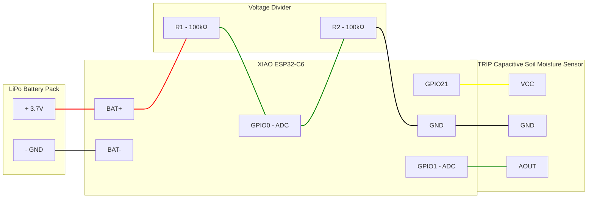

# Soil W001 - Wiring

## Connections

### Power (LiPo Battery Pack)

| Battery Pack Pin | XIAO ESP32-C6 Pin | Notes |
|------------------|-------------------|-------|
| + | BAT+ pad | Solder to positive battery pad (near D5 silk) |
| - | BAT- pad | Solder to negative battery pad (near D8 silk) |

### Battery Voltage Monitor

| Component | XIAO ESP32-C6 Pin | Notes |
|-----------|-------------------|-------|
| BAT+ pad | R1 (100kΩ) | Battery voltage source |
| R1 → R2 node | GPIO0 (D0) | ADC input (1:2 voltage divider) |
| R2 (100kΩ) | GND | Ground |

### Soil Moisture Sensor

| Sensor Pin | XIAO ESP32-C6 Pin | Notes |
|------------|-------------------|-------|
| VCC | GPIO21 (D3) | Power gated via digital pin |
| GND | GND | Ground |
| AOUT | GPIO1 (D1) | Analog moisture reading |

## Pin Assignment Strategy

The XIAO ESP32-C6 has only 3 ADC-capable pins on its breakout headers:
GPIO0 (D0), GPIO1 (D1), and GPIO2 (D2). All other GPIOs are digital only.

**Preferred approach:** Reserve ADC pins for analog inputs. Use non-ADC
pins (GPIO21/D3, GPIO22/D4, GPIO23/D5, etc.) for digital functions like
power gating, LEDs, and button inputs.

## Diagram

