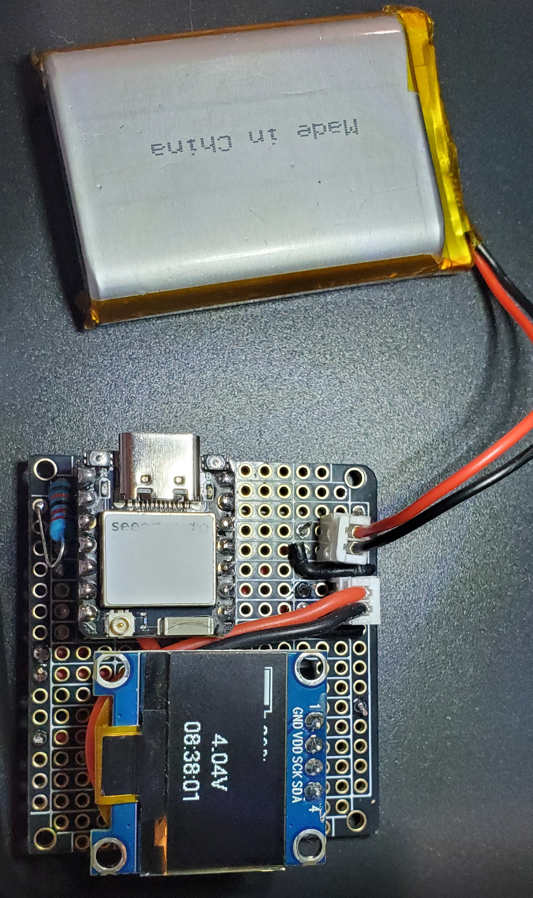
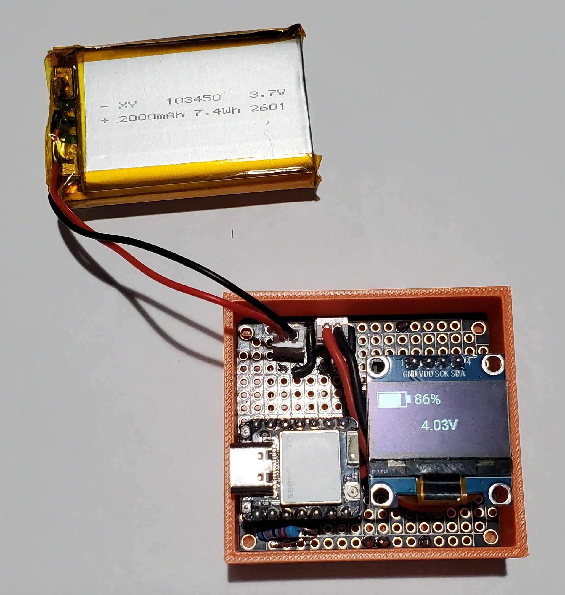
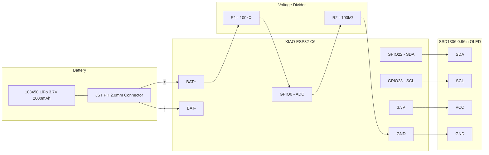

# XIAO ESP32C6 Lipo Charger With OLED Display
## Overview
I wanted to explore the built-in battery charging functionality that comes
on several of the XIAO boards. The project can be used to re-charge a
`103450` LiPo battery with a JST PH 2.0mm connector.

Originally I had anticipated doing this project using PlatformIO and some
custom code, but fairly early on I realized ESPHome actually had everything
I needed. By leaning into an ESPHome based approach, not only will I get 
history of the charging data on the sensors, but I will also be able to
hook up automations so I can be alerted when the battery is charged.

Its worth calling out that while this was a fun project to build, it is in
no way the best option if all you want is a battery charger. The ADC on the
ESP32 is not super precise and charging is *very* slow. 

TLDR - If your looking for a fun project, keep reading. If your looking
for a quality battery charger, look elsewhere.

## Bill Of Materials

**NOTE** - prices as of 2026-04-05

* 1x [ElectroCookie Prototype board](/components/ElectroCookie_ECPB_SNAP_BK_3P.md) - $0.83
* 1x [XIAO ESP32C6](https://www.seeedstudio.com/Seeed-StudioXIAO-ESP32C6-3PCS-p-5918.html) - $4.35
* 2x [JST PH 2.0mm connectors](https://www.amazon.com/dp/B0D7Q9HJLQ?ref=ppx_yo2ov_dt_b_fed_asin_title) - $0.35
* 2x [100K ohm resistors](https://www.amazon.com/dp/B09PLNPX3P?th=1) - $0.04
* 1x [0.96" OLED Display](https://www.aliexpress.us/item/3256807203415717.html?spm=a2g0o.order_list.order_list_main.11.257b18021RViJw&gatewayAdapt=glo2usa) - $1.99

Total project cost: **$7.56**

The `103450` is not included in this BOM as the primary purpose of this
project is to charge ones you already have.

## Wiring

## Home Assistant
Since we have flashed this project using ESPHome we get a number of goodies
on the device page. Refer to [ESPHome Configuration](/config/xiao-c6-lipo-charger-with-oled.yaml).

