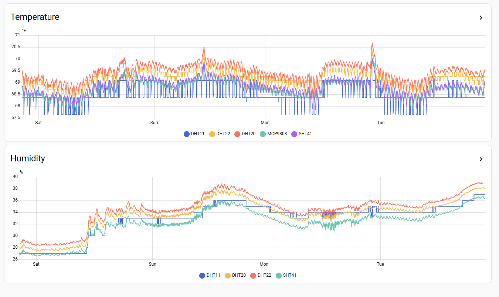

# Temperature Sensor Bake Off

## Overview

This experiment compares five popular temperature sensors to evaluate their consistency and value proposition for home automation projects. All sensors were connected to a single ESP32 Xiao C6 microcontroller and monitored simultaneously over several days in identical environmental conditions using ESPHome with no custom code.

Note: This test does not include a calibrated reference sensor, so absolute accuracy cannot be determined. The analysis focuses on relative performance, consistency, and noise characteristics between sensors.

## Components

The test setup included the following sensors:

- **DHT11** - Temperature and humidity sensor using single-wire digital protocol (GPIO2)
- **DHT22** - Temperature and humidity sensor using single-wire digital protocol (GPIO21)
- **DHT20** - I2C-based temperature and humidity sensor, successor to DHT11/DHT22 line (I2C address 0x38)
- **MCP9808** - I2C temperature sensor without humidity measurement (I2C address 0x18)
- **SHT41** - I2C temperature and humidity sensor from Sensirion (I2C address 0x44)

All sensors were read at 60-second intervals and displayed on a SSD1306 OLED screen for real-time monitoring. The I2C sensors shared a common bus (SDA: GPIO22, SCL: GPIO23), while the DHT11 and DHT22 used separate GPIO pins with internal pullup resistors.

## Data



The graphs reveal several key patterns:

**Temperature Readings:**
- The DHT11 (blue) consistently reads 0.5-1.5°F lower than other sensors and exhibits significant noise with frequent dropouts
- The DHT22 (orange) and DHT20 (red) track closely together, typically reading 0.5-1°F higher than the I2C sensors
- The MCP9808 (teal) and SHT41 (purple) show the tightest correlation and smoothest readings with minimal noise
- All sensors track ambient temperature changes consistently, with clear diurnal patterns visible

**Humidity Readings:**
- The DHT11 shows frequent dropouts and erratic readings
- The DHT22 and DHT20 track similarly but with the DHT20 showing slightly smoother data
- The SHT41 provides the most stable humidity readings with minimal noise
- All humidity sensors show the expected inverse relationship with temperature

## Conclusion

The data demonstrates clear differences in sensor behavior and consistency:

**DHT11 (~$2-3):** Frequent dropouts and high noise make this unsuitable for reliable monitoring despite its low cost.

**DHT22 (~$5-8) and DHT20 (~$3-5):** Both perform similarly with the DHT20 offering I2C convenience. Suitable for non-critical temperature monitoring where occasional variance is acceptable.

**MCP9808 (~$5-7) and SHT41 (~$8-12):** Both show tighter correlation with each other and smoother readings with minimal noise. The MCP9808 is temperature-only while the SHT41 includes humidity sensing.

For typical home automation projects, the DHT22 or DHT20 provide good value. For applications requiring more stable and consistent readings (e.g., server room monitoring, HVAC control), the SHT41 or MCP9808 may be worth the additional cost based on their lower noise characteristics observed in this test.

## Appendix: ESPHome Configuration

The following ESPHome configuration was used for this experiment:

```yaml
# This configuration is for a Frankenstien setup used for comparing multiple temperature sensors.
# It is not intended to be a deployed sensor.
#
# Components:
# - DHT11 temperature and humidity sensor
# - DHT22 temperature and humidity sensor
# - DHT20 temperature sensor
# - MCP9808 temperature sensor
# - SHT41 temperature sensor
# - ESP32 Xiao C6 microcontroller
#
# Pinout:
# All I2C sensors are on their default I2C addresses, 
# SDA is on GPIO22, SCL is on GPIO23.
# 
# DHT22 is attached to GPIO21 no external resistor.
# DHT11 is attached to GPIO2 no external resistor.
#
# In addition to the sensors mentions above this setup has a SSD1306 OLED display attached to the I2C bus for displaying the sensor readings.
# We want a "grid" style output where each line is one sensor. The line should identify the senors, its temp reading, and its humidity reading if it has one. 
# The display should update when the sensors are read. The OLED is a two color, with the top yellow and bottom blue. Keep all the sensor in the blue section.

substitutions:
  name: xiao-c6-multi-temp
  friendly_name: Xiao C6 Multi Temp

esphome:
  name: "${name}"
  name_add_mac_suffix: true
  friendly_name: "${friendly_name}"

packages:
  - !include common/base.yaml
  - !include common/wifi.yaml
  - !include boards/esp32-xiao-c6.yaml

sensor:
  - platform: dht
    pin:
      number: GPIO21
      mode:
        input: true
        pullup: true
    model: DHT22_TYPE2
    temperature:
      name: "DHT22 Temperature"
      id: dht22_temp
      on_value:
        then:
          - component.update: oled_display
    humidity:
      name: "DHT22 Humidity"
      id: dht22_hum
    update_interval: 60s

  - platform: dht
    pin:
      number: GPIO2
      mode:
        input: true
        pullup: true
    model: DHT11
    temperature:
      name: "DHT11 Temperature"
      id: dht11_temp
    humidity:
      name: "DHT11 Humidity"
      id: dht11_hum
    update_interval: 60s

  - platform: aht10
    variant: AHT20
    address: 0x38
    temperature:
      name: "DHT20 Temperature"
      id: dht20_temp
      on_value:
        then:
          - component.update: oled_display
    humidity:
      name: "DHT20 Humidity"
      id: dht20_hum
    update_interval: 60s

  - platform: mcp9808
    address: 0x18
    name: "MCP9808 Temperature"
    id: mcp9808_temp
    on_value:
      then:
        - component.update: oled_display
    update_interval: 60s

  - platform: sht4x
    address: 0x44
    temperature:
      name: "SHT41 Temperature"
      id: sht41_temp
      on_value:
        then:
          - component.update: oled_display
    humidity:
      name: "SHT41 Humidity"
      id: sht41_hum
    update_interval: 60s

display:
  - platform: ssd1306_i2c
    model: "SSD1306 128x64"
    address: 0x3C
    id: oled_display
    lambda: |-
      it.printf(0, 17, id(display_font), "DHT22 %5.1f   %3.0f%%", id(dht22_temp).state, id(dht22_hum).state);
      it.printf(0, 26, id(display_font), "DHT11 %5.1f   %3.0f%%", id(dht11_temp).state, id(dht11_hum).state);
      it.printf(0, 35, id(display_font), "DHT20 %5.1f   %3.0f%%", id(dht20_temp).state, id(dht20_hum).state);
      it.printf(0, 44, id(display_font), "MCP08 %5.1f", id(mcp9808_temp).state);
      it.printf(0, 53, id(display_font), "SHT41 %5.1f   %3.0f%%", id(sht41_temp).state, id(sht41_hum).state);

font:
  - file: "gfonts://Roboto"
    id: display_font
    size: 9
```

